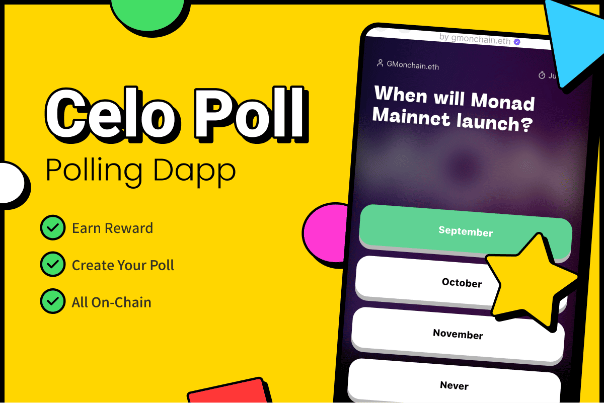
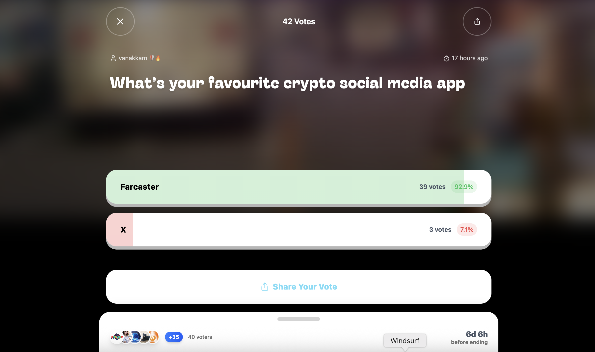
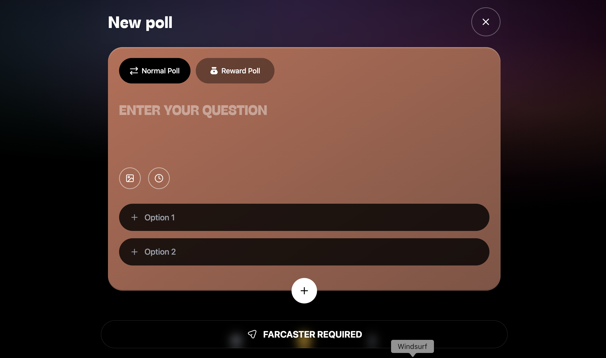

    

## The Problem Celo Poll Solves

**Celo Poll** addresses the significant challenges within on-chain voting by offering a **Farcaster miniapp** designed for seamless poll creation and participation. Traditional voting tools often suffer from being off-chain, lacking transparency, or failing to incentivize user engagement. This leads to:

*   **Low User Engagement:** Without compelling reasons to participate, voter turnout remains low.
*   **Limited Trust in Results:** Opaque processes undermine confidence in the integrity of voting outcomes.
*   **Barriers for Newcomers:** The complexity of blockchain interactions deters new users from exploring networks like Celo.

## Screenshots

<table style="width:100%">
  <tr>
    <td style="width:50%; text-align:center;">
      
    </td>
    <td style="width:50%; text-align:center;">
      
    </td>
  </tr>
</table>

## Our Solution

Celo Poll tackles these issues head-on by:

*   **Rewarding Participation:** Every vote cast comes with built-in rewards, directly incentivizing users to engage.
*   **Ensuring Transparency:** All interactions are powered by a robust smart contract on the **Celo blockchain**, providing verifiable and transparent results. You can view all transactions on [Celoscan](https://celoscan.io/).
*   **Delivering a Superior User Experience:** Our miniapp features a clean, intuitive, and user-friendly interface, making it incredibly easy for anyone—from crypto natives to blockchain newcomers—to explore and get familiar with the Celo network.

Celo Poll is more than just a voting tool; it's a gateway to a more interactive, transparent, and rewarding on-chain experience.

## Farcaster Mini App
Explore FarRank on Farcaster: [https://farcaster.xyz/miniapps/Cd4WmQSF2Xct/farrank](https://farcaster.xyz/miniapps/Cd4WmQSF2Xct/farrank)
